## About Me  

💡 Apaixonado por tecnologia, desenvolvedor **Angular** e **Analista de BI**.                
📚 Formado em ADS, Ciências Contábeis e Pós em Data Analytics.              
🔥 Sempre buscando oportunidades para novos aprendizados, independente da tecnologia.

---

## 📈 GitHub Stats

  

---

---

---

<a href="https://github.com/seu-usuário-aqui">

---

  

---

 

---

 
<b>Visitors Count</b>
  

 

<h2 align="center">📈 Full GitHub Insights</h2>

  

